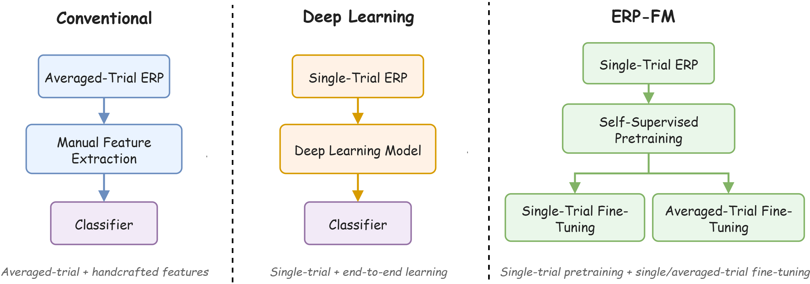

# ERP-FM: A Foundation Model for Universal ERP Analysis



**ERP-FM** is a lightweight foundation model designed specifically for **event-related potential (ERP) representation learning**. It is pretrained with masked autoencoding on a large-scale single-trial ERP corpus, and supports both single-trial and averaged-trial downstream analysis. 
The paper answers two questions: how foundation-model pretraining benefits ERP tasks, and how the complementary advantages of single-trial and averaged-trial ERP can be combined for downstream applications.

## Contents

**[Method](#method)** · **[Datasets](#datasets)** · **[Data Preprocessing](#data-preprocessing)** · **[Installation](#installation)** · **[Reproducing Experiments](#reproducing-experiments)** · **[Quick Start](#quick-start)** · **[Applying to Your Own Dataset](#applying-to-your-own-dataset)** · **[Acknowledgments](#acknowledgments)**


## Method


**1) Single-trial masked autoencoding.** Each ERP epoch is divided into non-overlapping, single-channel temporal patches. Temporal and electrode-coordinate positional embeddings are added to the tokens. A mixed masking strategy samples **random**, **temporal**, or **spatial** masking for each batch. An encoder–decoder Transformer reconstructs the masked raw-signal patches using Smooth L1 loss. Only the pretrained encoder is retained for downstream adaptation.
**2) Single-trial or averaged-trial adaptation.** The encoder is used for either **linear probing** (frozen encoder) or **fine-tuning** (trainable encoder). Averaged-trial ERP is constructed by averaging normalized trials belonging to the same subject and ERP event/condition; pretraining itself always uses single trials.
**3) Downstream tasks.** ERP-FM supports ERP **event/condition classification** and **neurological disease classification**. For subject-level neurological disease detection, predictions from the same subject are aggregated with majority voting.


## Datasets

We distinguish **ERP** recordings used as transient event-related responses from **non-ERP EEG** recordings used in the pretraining ablations. A dataset family may contribute multiple task-level entries to the paper's dataset count. To avoid repeated links, the tables below generally provide **one original data-source entry per family** (e.g., one ERP CORE entry rather than seven separate ERP CORE rows). Where a family is distributed across different repositories, its separate raw-data links are retained.

### ERP datasets

#### ERP pretraining corpus (38 task-level datasets)
| Original dataset / family      | Task-level datasets in the corpus | Raw data                                                                                                                                                                                      |
|:-------------------------------|----------------------------------:|:----------------------------------------------------------------------------------------------------------------------------------------------------------------------------------------------|
| AUD-MAB                        |                                 1 | [OpenNeuro](https://openneuro.org/datasets/ds005907/versions/1.0.0)                                                                                                                           |
| AUD-PS                         |                                 1 | [OpenNeuro](https://openneuro.org/datasets/ds004515/versions/1.0.0)                                                                                                                           |
| AVSPP                          |                                 1 | [OpenNeuro](https://openneuro.org/datasets/ds003190/versions/1.0.1)                                                                                                                           |
| AVSS                           |                                 2 | [OpenNeuro](https://openneuro.org/datasets/ds002893/versions/2.0.0)                                                                                                                           |
| CCT-MJAH                       |                                 1 | [OpenNeuro](https://openneuro.org/datasets/ds004860/versions/1.0.0)                                                                                                                           |
| EPSD                           |                                 1 | [OpenNeuro](https://openneuro.org/datasets/ds003474/versions/1.1.0)                                                                                                                           |
| ERP CORE                       |                                 7 | [Original OSF project](https://osf.io/thsqg/)                                                                                                                                                 |
| Go-Nogo                        |                                 1 | [OpenNeuro](https://openneuro.org/datasets/ds002680/versions/1.0.0)                                                                                                                           |
| HBN-EEG (releases 1–11)        |                                 3 | [HBN-EEG release index](https://nemar.org/dataexplorer/local?search=HBN-EEG)                                                                                                                  |
| HeartBEAM                      |                                 1 | [OpenNeuro](https://openneuro.org/datasets/ds006480/versions/1.0.0)                                                                                                                           |
| IMS-ODD                        |                                 1 | [OpenNeuro](https://openneuro.org/datasets/ds003570/versions/1.0.0)                                                                                                                           |
| MMPST                          |                                 4 | [OpenNeuro](https://openneuro.org/datasets/ds004315/versions/1.0.0)                                                                                                                           |
| MRI-AODD                       |                                 1 | [OpenNeuro](https://openneuro.org/datasets/ds003061/versions/1.1.2)                                                                                                                           |
| mTBI (separate task releases)  |                                 3 | [DPX](https://openneuro.org/datasets/ds005114/versions/1.0.0) · [ODD](https://openneuro.org/datasets/ds003522/versions/1.1.0) · [VWM](https://openneuro.org/datasets/ds003523/versions/1.1.0) |
| NAFPS                          |                                 1 | [OpenNeuro](https://openneuro.org/datasets/ds005565/versions/1.0.3)                                                                                                                           |
| PLAF (two experiment releases) |                                 2 | [Experiment 1](https://openneuro.org/datasets/ds003822/versions/1.1.0) · [Experiment 2](https://openneuro.org/datasets/ds003753/versions/1.1.0)                                               |
| PSTCC                          |                                 1 | [OpenNeuro](https://openneuro.org/datasets/ds004532/versions/1.2.0)                                                                                                                           |
| Runabout                       |                                 1 | [OpenNeuro](https://openneuro.org/datasets/ds003620/versions/1.1.1)                                                                                                                           |
| SICE                           |                                 1 | [Dryad](https://datadryad.org/dataset/doi:10.5061/dryad.6wwpzgmx4)                                                                                                                            |
| SIMCC                          |                                 2 | [OpenNeuro](https://openneuro.org/datasets/ds003518/versions/1.1.0)                                                                                                                           |
| TABG                           |                                 1 | [OpenNeuro](https://openneuro.org/datasets/ds003458/versions/1.1.0)                                                                                                                           |
| VWMCC                          |                                 1 | [OpenNeuro](https://openneuro.org/datasets/ds003519/versions/1.1.0)                                                                                                                           |
| **Total**                      |                            **38** |                                                                                                                                                                                               |

In particular, ERP CORE contributes seven task-level datasets, HBN-EEG contributes three tasks, MMPST contributes four experimental splits, and AVSS and SIMCC each contribute two. The paper's full task-level names, epoch windows, sample counts, and electrode counts are in **Appendix A, Table 11**.


#### ERP downstream datasets (12 task-level datasets)
| Task category        | Original dataset / family                 | Benchmarks in this repository               | Raw data                                                                                                                                          |
|:---------------------|:------------------------------------------|:--------------------------------------------|:--------------------------------------------------------------------------------------------------------------------------------------------------|
| Event/condition      | CESCA                                     | `CESCA-AODD`, `CESCA-VODD`, `CESCA-FLANKER` | [OpenNeuro](https://openneuro.org/datasets/ds006018/versions/1.2.2)                                                                               |
| Event/condition      | TDBrain                                   | `TDBrain-ODD`                               | [Brainclinics](https://brainclinics.com/resources)                                                                                                |
| Event/condition      | Nencki-Symfonia ERP (NSERP)               | `NSERP-MSIT`, `NSERP-ODD`                   | [OpenNeuro](https://openneuro.org/datasets/ds004621/versions/1.0.4)                                                                               |
| Neurological disease | Parkinson's Simon task                    | `PD-SIM`                                    | [OpenNeuro](https://openneuro.org/datasets/ds004580/versions/1.0.0)                                                                               |
| Neurological disease | Parkinson's oddball task                  | `PD-ODD`                                    | [OpenNeuro](https://openneuro.org/datasets/ds004574/versions/1.0.0)                                                                               |
| Neurological disease | ADHD working memory / response inhibition | `ADHD-WMRI`                                 | [Figshare](https://figshare.com/articles/dataset/EEG_raw_data_-_Economical_Assessment_of_Working_Memory_and_Response_Inhibition_in_ADHD/12115773) |
| Neurological disease | SCPD                                      | `SCPD`                                      | [OpenNeuro](https://openneuro.org/datasets/ds003509/versions/1.1.0)                                                                               |
| Neurological disease | RLPD                                      | `RLPD`                                      | [OpenNeuro](https://openneuro.org/datasets/ds003506/versions/1.1.0)                                                                               |
| Neurological disease | AOPD                                      | `AOPD`                                      | [OpenNeuro](https://openneuro.org/datasets/ds003490/versions/1.1.0)                                                                               |

The downstream benchmarks are split into two task categories. Related tasks that share one raw-data release are listed together.
The six event/condition benchmarks predict experimental conditions, such as standard versus target stimuli; the six neurological disease benchmarks predict disease labels (e.g., healthy control versus Parkinson's disease). See **Table 1** of the paper for per-dataset statistics and epoch/baseline windows.


---


### Non-ERP EEG datasets (pretraining ablation only)

| Original dataset | Recording type in this study                              | Raw data                                                                              |
|:-----------------|:----------------------------------------------------------|:--------------------------------------------------------------------------------------|
| BACA-RS          | Resting state                                             | [OpenNeuro](https://openneuro.org/datasets/ds005385/versions/1.0.3)                   |
| CAUEEG           | Resting state, photic stimulation, hyperventilation, etc. | [Original dataset repository](https://github.com/ipis-mjkim/caueeg-dataset)           |
| P-ADIC           | Resting state                                             | [Dryad](https://datadryad.org/dataset/doi:10.5061/dryad.8gtht76pw)                    |
| TDBrain          | Resting state                                             | [Brainclinics](https://brainclinics.com/resources)                                    |
| TUEP             | Clinical EEG                                              | [TUH EEG portal](https://isip.piconepress.com/projects/nedc/html/tuh_eeg/index.shtml) |

These five original sources contribute **2,544,890 fixed-length EEG segments from 3,709 unique subjects**. They are used in the EEG-only, joint EEG+ERP, and sequential EEG→ERP pretraining ablations; they are **not** part of the 38-dataset ERP-only base-model pretraining corpus.
See **Appendix A, Table 12** for preprocessing windows and dataset statistics. Observe each source's access requirements, data-use conditions, and citation instructions.


## Data Preprocessing

### Preprocessing pipeline

The pipeline follows the ERP-Benchmark preprocessing protocol, with dataset-specific epoch and baseline windows:

1. Remove non-EEG channels (e.g., EOG or coordinate information).
2. Apply a 50/60 Hz notch filter and a 0.5–45 Hz band-pass filter.
3. Interpolate bad channels and apply average re-referencing.
4. When prior artifact rejection is unavailable, use ICA with ICLabel to remove artifact-related components.
5. Resample recordings to **200 Hz**.
6. For **ERP**, epoch recordings by stimulus/response/feedback event and apply a task-specific pre-event baseline. For **non-ERP EEG**, segment continuous recordings into fixed-length windows and skip ERP baseline correction.
7. Assign disease, event/condition, subject, and task identifiers; save per-dataset metadata.
8. During data loading, apply channel-wise z-score normalization independently to each trial. For averaged-trial experiments, average normalized trials with matching **subject ID and event/condition ID**, after subject-level splitting.

The repository includes dataset-specific notebooks and accompanying notes for several downstream sources in [`data_preprocessing/`](data_preprocessing/). The supplied repository does **not** include a preprocessing notebook for every pretraining dataset; consult the paper's Appendix A and adapt the same pipeline to additional raw sources as needed.

### Processed dataset format

The loader expects each dataset under the sampling-rate directory. For example:

```text
dataset/
└── 200Hz/
    ├── PD-SIM/
    │   ├── meta.json
    │   ├── X.dat
    │   └── y.dat
    ├── CESCA-AODD/
    │   ├── meta.json
    │   ├── X.dat
    │   └── y.dat
    └── ...
```

- **`X.dat`**: NumPy memory-mapped EEG data, `float32`, shape **`[N, T, C]`** (trials × timestamps × channels).
- **`y.dat`**: NumPy memory-mapped labels, `float32`, shape **`[N, 4]`**, in the exact order **`[disease_id, stimulus_type, subject_id, task_id]`**. The loader converts these into its internal multi-dataset label representation.
- **`meta.json`**: required metadata such as `N`, `T`, `C`, `SAMPLE_RATE`, `MONTAGE`, `CHANNELS`, `TMIN`, `TMAX`, `BASELINE`, and `LABELS`, as applicable. The loaders use this information to determine shapes and channel identities.

Unavailable disease or event labels may be encoded with `-1` where specified in the dataset metadata; valid labels for the selected classification target must be contiguous non-negative class IDs. See the individual preprocessing notebooks and [`data_provider/dataset_loader/base_loader.py`](data_provider/dataset_loader/base_loader.py) before writing custom data.

The processed datasets can be downloaded here: [processed datasets](https://drive.google.com/drive/folders/1d2yNX6SHVhlnyJgN-kqawQhvIiJeLzdZ?usp=drive_link).
After downloading, place processed datasets in `dataset/200Hz/<DATASET_NAME>/` .

## Installation

The experiments are run with **Python 3.10**, **PyTorch 2.5.1 + CUDA 12.1**, and four NVIDIA RTX A5000 GPUs. To install the dependencies from this repository:

```bash
pip install -r requirements.txt
```

Install a PyTorch build compatible with your CUDA driver and GPU environment. The exact pinned package versions are in [`requirements.txt`](requirements.txt).

## Reproducing Experiments

All commands should be run from the repository root. Dataset folder names in `--pretraining_datasets` and `--training_dataset` must match the directories under `dataset/200Hz/`.

| Training mode                            | Entry point / reference script                                                                                                                                      | Purpose                                                           |
|:-----------------------------------------|:--------------------------------------------------------------------------------------------------------------------------------------------------------------------|:------------------------------------------------------------------|
| ERP-only MAE pretraining (base model)    | [`P-38.sh`](scripts/ERP-FM/pretrain/ERP-FM/P-38.sh)                                                                                                                 | Pretrain on all 38 ERP task-level datasets.                       |
| Linear probing                           | [`P-38-Pr-1.sh`](scripts/ERP-FM/probe/ERP-FM/P-38-Pr-1.sh)                                                                                                          | Freeze the pretrained encoder and train downstream classifier(s). |
| Fine-tuning                              | [`P-38-F-1.sh`](scripts/ERP-FM/finetune/ERP-FM/P-38-F-1.sh)                                                                                                         | Adapt encoder and classifier on downstream datasets.              |
| Averaged-trial probing / fine-tuning     | [`P-38-Pr-1-Averaged.sh`](scripts/ERP-FM/probe/ERP-FM/P-38-Pr-1-Averaged.sh) / [`P-38-F-1-Averaged.sh`](scripts/ERP-FM/finetune/ERP-FM/P-38-F-1-Averaged.sh)        | Use `--average_trials` in downstream training.                    |
| Fully supervised from scratch            | [`S-1.sh`](scripts/ERP-FM/supervised/ERP-FM/S-1.sh)                                                                                                                 | Train without pretraining.                                        |
| EEG-only / joint / sequential ablations  | [`P-5.sh`](scripts/ERP-FM/pretrain/ERP-FM/P-5.sh), [`P-43.sh`](scripts/ERP-FM/pretrain/ERP-FM/P-43.sh), [`P-5-P-38.sh`](scripts/ERP-FM/pretrain/ERP-FM/P-5-P-38.sh) | Compare non-ERP-only, joint EEG+ERP, and EEG→ERP pretraining.     |
| Other masking and patch-length ablations | [`scripts/ERP-FM/`](scripts/ERP-FM/)                                                                                                                                | Additional controlled experiments.                                |
| Supervised baseline models               | [`meta_run_baseline_methods.sh`](meta_run_baseline_methods.sh)                                                                                                      | Run reference baseline scripts.                                   |

For the main collection of experiments, refer to [`meta_run.sh`](meta_run.sh). It runs the available ERP-FM scripts sequentially; edit the commands to select only the experiments you need. GPU visibility can be set, for example, with `export CUDA_VISIBLE_DEVICES=0,1,2,3`, and the logical device IDs passed through `--devices` as appropriate for your configuration.
With `--method ERP-FM`, outputs are organized as follows:
```text
checkpoints/ERP-FM/<task_name>/ERP-FM/<model_id>/<model_setting>/checkpoint.pth
results/ERP-FM/<task_name>/ERP-FM/<model_id>/...
```

For the standard ERP-only pretrained model, the seed-41 checkpoint expected by the reference fine-tuning scripts is:

```text
checkpoints/ERP-FM/pretrain/ERP-FM/P-38-e12-d2-smooth-l1-0.5-mixed/nh8_el12_dl2_dm128_df256_seed41/checkpoint.pth
```

## Quick Start

The following example reproduces the key pipeline in **Table 10** of the paper on **RLPD** (56 subjects; healthy controls versus Parkinson's disease): **single-trial self-supervised pretraining → averaged-trial fine-tuning → subject-level majority voting**. ERP-FM is pretrained on single trials, then fine-tuned on higher-SNR ERPs formed by averaging trials from the same subject and event/condition. Subject-level predictions are obtained by majority voting across the averaged ERPs belonging to each subject.

**RLPD results from Table 10** (mean ± standard deviation over five runs):

| Training and inference setting                  | Evaluation level          |     Accuracy (%) |           F1 (%) |        AUROC (%) |
|:------------------------------------------------|:--------------------------|-----------------:|-----------------:|-----------------:|
| Single-trial supervised learning from scratch   | Trial                     |     64.34 ± 4.99 |     60.07 ± 5.40 |     67.41 ± 7.80 |
| Single-trial fine-tuning                        | Subject (majority voting) |     73.33 ± 6.24 |     72.77 ± 6.37 |     83.33 ± 5.83 |
| Averaged-trial fine-tuning                      | Trial (averaged ERP)      |     79.20 ± 3.57 |     79.14 ± 3.58 |     89.13 ± 3.97 |
| **Averaged-trial fine-tuning + subject voting** | **Subject**               | **95.00 ± 4.08** | **94.97 ± 4.11** | **98.89 ± 1.62** |

This example illustrates the complementary strengths of abundant single-trial data for self-supervised pretraining and higher-SNR averaged ERPs for downstream adaptation. Trial-level and subject-level metrics are reported separately; the subject-level results aggregate predictions from the same person.

### 1. Prepare data and pretrained checkpoint

Download the [processed datasets](https://drive.google.com/drive/folders/1d2yNX6SHVhlnyJgN-kqawQhvIiJeLzdZ?usp=drive_link) and [pretrained checkpoints](https://drive.google.com/open?id=1zlBAQwGs_Fd4BZqZMXXPP8PI45Ls7bRB&usp=drive_copy), then place the RLPD files and the ERP-only base checkpoint at these paths:

```text
dataset/200Hz/RLPD/
├── meta.json
├── X.dat
└── y.dat

checkpoints/ERP-FM/pretrain/ERP-FM/P-38-e12-d2-smooth-l1-0.5-mixed/
└── nh8_el12_dl2_dm128_df256_seed41/
    └── checkpoint.pth
```

### 2. Run averaged-trial fine-tuning with subject-level voting

Run the following command from the repository root. It uses the RLPD configuration in [`P-38-F-1-Averaged.sh`](scripts/ERP-FM/finetune/ERP-FM/P-38-F-1-Averaged.sh) and runs all five seeds (41–45):

```bash
python -u run.py \
  --method ERP-FM --task_name finetune --is_training 1 \
  --root_path ./dataset/200Hz/ --data MultiDatasets \
  --training_dataset RLPD --classify_choice disease \
  --model ERP-FM --model_id P-38-F-RLPD-smooth-l1-0.5-mixed-e12-d2-averaged \
  --checkpoints_path ./checkpoints/ERP-FM/pretrain/ERP-FM/P-38-e12-d2-smooth-l1-0.5-mixed/nh8_el12_dl2_dm128_df256_seed41/ \
  --e_layers 12 --d_layers 2 --n_heads 8 --d_model 128 --d_ff 256 --patch_len 50 \
  --average_trials --use_subject_vote --batch_size 32 --swa \
  --cross_val mccv --ratio_a 0.6 --ratio_b 0.8 \
  --learning_rate 0.0001 --train_epochs 200 --patience 15 \
  --des Exp --itr 5 --devices 0
```

### 3. Important command-line arguments

| Argument                                             | Description                                                                                                                                                                              |
|:-----------------------------------------------------|:-----------------------------------------------------------------------------------------------------------------------------------------------------------------------------------------|
| `--method ERP-FM`, `--model ERP-FM`                  | Select the ERP-FM experiment method and backbone.                                                                                                                                        |
| `--task_name finetune`                               | Fine-tune the pretrained encoder together with a new downstream classifier. Use `probe` instead for a frozen-encoder linear probe.                                                       |
| `--is_training 1`                                    | Train and then evaluate the model.                                                                                                                                                       |
| `--root_path ./dataset/200Hz/`                       | Root directory containing processed 200 Hz datasets.                                                                                                                                     |
| `--data MultiDatasets`                               | Use the repository's processed EEG/ERP dataset loader.                                                                                                                                   |
| `--training_dataset RLPD`                            | Select RLPD as the downstream dataset for training, validation, and testing.                                                                                                             |
| `--classify_choice disease`                          | Predict disease labels (healthy control versus Parkinson's disease), not stimulus/event types.                                                                                           |
| `--checkpoints_path`                                 | Path to the pretrained ERP-only checkpoint, or its parent directory containing `checkpoint.pth`. The seed-41 pretraining checkpoint initializes each downstream run.                     |
| `--model_id`                                         | Experiment identifier used in checkpoint and result directories.                                                                                                                         |
| `--e_layers 12`, `--d_layers 2`                      | Encoder and pretraining-decoder layer settings associated with the base-model configuration.                                                                                             |
| `--n_heads 8`, `--d_model 128`, `--d_ff 256`         | Attention heads, model embedding dimension, and feed-forward hidden dimension.                                                                                                           |
| `--patch_len 50`                                     | Each channel is divided into 50-sample patches (0.25 s at 200 Hz).                                                                                                                       |
| **`--average_trials`**                               | After subject-independent splitting, average normalized trials with the same subject ID and event/condition ID, separately within TRAIN/VAL/TEST. Pretraining always uses single trials. |
| **`--use_subject_vote`**                             | Compute subject-level predictions and metrics by majority voting over the averaged-trial predictions belonging to each subject. Trial-level metrics are also reported.                   |
| `--batch_size 32`                                    | Batch size for averaged-trial fine-tuning.                                                                                                                                               |
| `--cross_val mccv`, `--ratio_a 0.6`, `--ratio_b 0.8` | Subject-independent Monte Carlo splitting: 60% training, 20% validation, and 20% testing, with no subject overlap.                                                                       |
| `--learning_rate 0.0001`                             | Fine-tuning learning rate.                                                                                                                                                               |
| `--train_epochs 200`, `--patience 15`                | Train for up to 200 epochs with early stopping (patience 15).                                                                                                                            |
| `--swa`                                              | Enable stochastic weight averaging during fine-tuning.                                                                                                                                   |
| `--itr 5`                                            | Repeat the experiment with seeds 41, 42, 43, 44, and 45; report mean and standard deviation.                                                                                             |
| `--devices 0`                                        | Use GPU device 0 (adjust to your available GPU configuration).                                                                                                                           |

The output folders follow the paths described in [Output paths](#output-paths), under the RLPD `--model_id`. The same averaged-trial script also contains commands for the other downstream datasets; select a different `--training_dataset` and matching `--model_id` to run them.

## Applying to Your Own Dataset

1. Preprocess raw recordings with the ERP pipeline above, using your event markers and appropriate epoch/baseline windows. Preserve electrode names and montage metadata.
2. Save `X.dat`, `y.dat`, and `meta.json` in `dataset/200Hz/<YOUR_DATASET_NAME>/` using the exact layout and label-column order described above.
3. Register the new dataset loader/name in [`data_provider/data_loader.py`](data_provider/data_loader.py) if needed, following an existing task-specific loader. Ensure that disease or event/condition labels are valid for the chosen `--classify_choice`.
4. Start from the ERP-only pretrained checkpoint and use either linear probing or fine-tuning. Optionally enable `--average_trials` for subject/event-specific averaging or `--use_subject_vote` for subject-level disease detection.

## Acknowledgments

We sincerely thank the researchers, clinical teams, and participants who collected, curated, and publicly shared datasets used in this study. Their contributions make this research possible.
